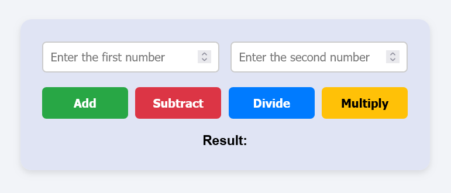

# Basic Calculator

A simple calculator web app built with HTML, CSS, and JavaScript.

## Features

- Takes two numeric inputs
- Performs:
  - Addition
  - Subtraction
  - Multiplication
  - Division
- Displays result below the buttons
- Shows a warning message if inputs are missing

